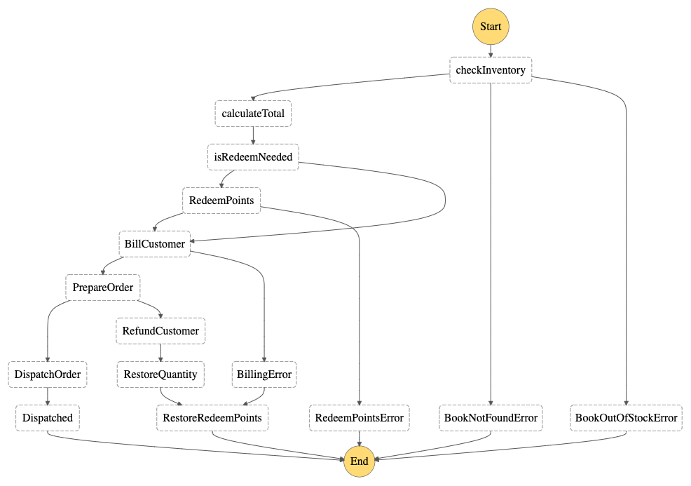
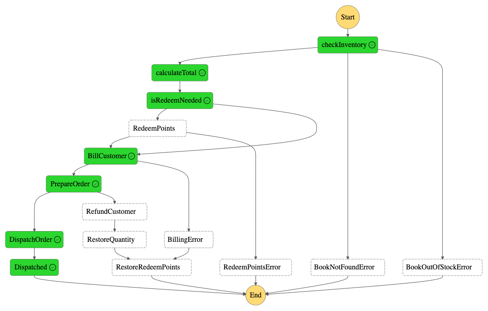

#### notes

create template proj
    
    sls create -t aws-nodejs

init Node proj

    npm init -y

sample input for first state

    {
        "userId": "1",
        "bookId": "100",
        "redeem" : false,
        "quantity": 200
        }

Sample state diagrams

